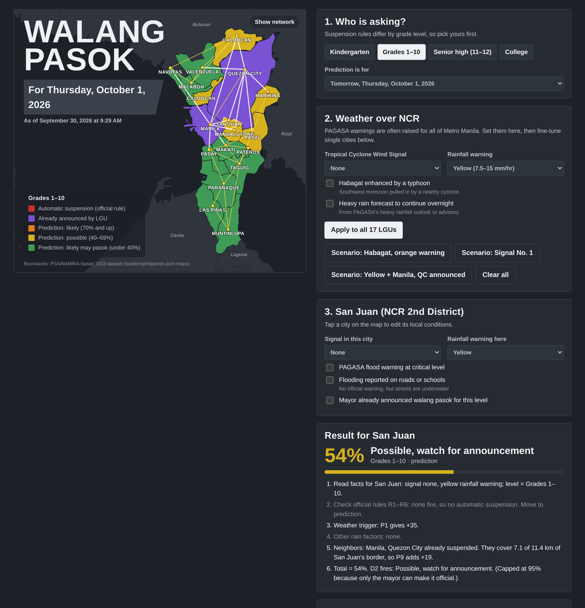

# Walang Pasok Predictor (NCR)

A knowledge-based / expert system that predicts class suspensions ("walang pasok") for the 17 LGUs of the National Capital Region. It gives a **certain answer** when an official rule applies, and a **capped likelihood** when the decision is left to the mayor.



## Run it

No install needed. Open `index.html` in any browser.

To host it online for free: go to **Settings → Pages**, set the source to the `main` branch and `/ (root)`, then save. The site appears at `https://<username>.github.io/<repo-name>/`.

## How to use

1. Pick a school level: Kindergarten, Grades 1–10, Senior high (11–12), or College.
2. Set the NCR-wide weather (signal, rainfall warning, habagat, continuing rain) and press **Apply to all 17 LGUs**, or load a sample scenario.
3. Tap a city to set its local conditions: flood warning, reported flooding, or an existing announcement.
4. Read the result, the step-by-step trace, and the Knowledge base tabs.

## Knowledge representation

| Technique | Where it is in the system |
| --- | --- |
| Logical | Facts such as `signal(manila, 2).` and statements such as `suspended(C, L) ← signal(C, S) ∧ S ≥ 3.` (Logical tab) |
| Frame | City frames (is_a, part_of, PSGC code, neighbors, conditions, conclusion) and warning frames (Frames tab) |
| Network | 17 LGU nodes and 35 border edges weighted by shared border length (Show network button, Network tab) |
| Procedural | Fixed 8-step reasoning procedure with a live trace (Procedural tab) |
| Rule-based | IF–THEN rules R1–R6 (official), P1–P9 (prediction), D1–D3 (decision) with fired rules highlighted (Rules tab) |

## Rules summary

**Official rules (certain answer, chain stops):**

- R1: Signal No. 3–5 → all levels suspended
- R2: Signal No. 2 → Kindergarten to Grade 10
- R3: Signal No. 1 → Kindergarten
- R4: Orange or Red rainfall warning → Kindergarten to Grade 12
- R5: Critical flood warning → Kindergarten to Grade 12
- R6: Mayor already announced → suspended

**Prediction rules (group heuristics, used only when no official rule fires):** the strongest of P1–P5 (Yellow +35, Signal 1 non-kinder +30, Signal 2 senior high +50, Signal 2 college +40, Orange/Red/flood warning college +50), plus P6 flooding reported +25, P7 habagat +10, P8 continuing rain +10, and P9 neighbors up to +30:

```
P9 = round(30 × border km shared with suspended neighbors ÷ total border km with NCR neighbors)
```

The score is capped at 95%. D1: 70 and up = likely walang pasok. D2: 40–69 = possible. D3: under 40 = likely may pasok. P9 only counts neighbors suspended by an official rule, so cities cannot raise each other's scores in a loop.

The prediction weights and thresholds are the group's own design and are not official.

## Project structure

```
index.html                 the complete app (open this)
data/ncr-geo.json          map paths, label points, adjacency edges
scripts/app_template.html  app source with a __GEO__ placeholder
scripts/build_app.py       injects the data into the template → index.html
scripts/build_geo.py       rebuilds ncr-geo.json from the boundary dataset
docs/screenshots/          demo screenshots
```

## Sources

1. DepEd Order No. 022, s. 2024 — Revised Guidelines on Class and Work Suspension in Schools During Disasters and Emergencies
2. Executive Order No. 66, s. 2012 — https://www.lawphil.net/executive/execord/eo2012/eo_66_2012.html
3. CHED statement on cancellation of classes in HEIs (CMO No. 15, s. 2012) — https://legacy.ched.gov.ph/statement-on-the-cancellation-of-classes-in-public-and-private-higher-heis/
4. PAGASA color-coded rainfall warnings (Yellow 7.5–15 mm/hr, Orange 15–30 mm/hr, Red over 30 mm/hr)
5. Boundaries: faeldon/philippines-json-maps (2023, PSA/NAMRIA-based) — https://github.com/faeldon/philippines-json-maps

Limitations: border lengths are approximate, and the 2023 boundary data may not fully reflect later changes to the Makati–Taguig boundary. Earthquakes, extreme heat, and power outages are out of scope.

## Team

- Arevalo, Miguel Isaac
- Austria, Marcus Yvan
- Billate, Rhown Leupert
- Dueda, Anjoe Carlo
- Nour, Sabir

*School project for an Artificial Intelligence course. Always follow official announcements from PAGASA, DepEd, CHED, and your LGU.*
