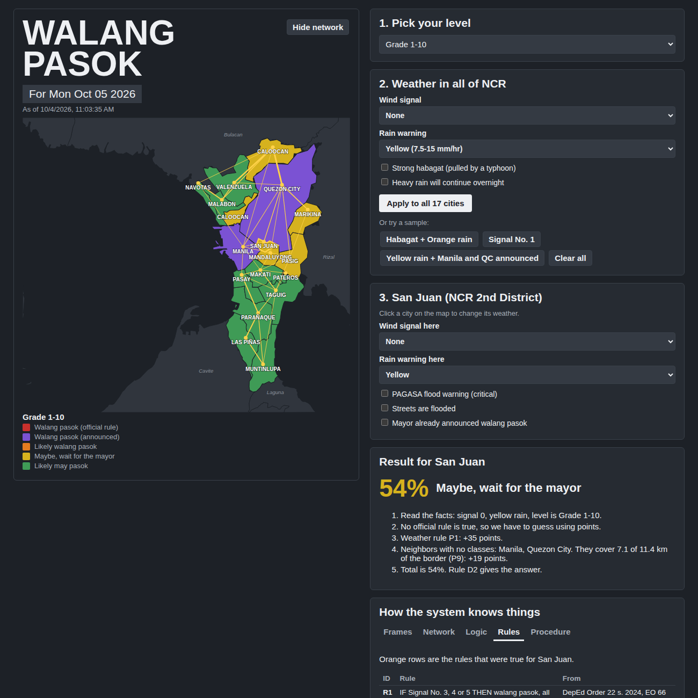

# Walang Pasok Predictor (NCR)

Our expert system guesses if there will be classes in the 17 cities of Metro Manila when there's a typhoon or heavy rain.

- If an **official rule** says no classes, it says **100% walang pasok**.
- If it's up to the **mayor**, it gives a **percent guess** using the weather and what nearby cities already did.

## How to open it

Just open `index.html` in a browser. Or use our live site on GitHub Pages.

## Which file does what

| File | What it is |
| --- | --- |
| `1-frames.js` | **Frames.** A "profile card" for each city (slots and values) and for each warning. |
| `2-network.js` | **Network.** Which cities touch each other, and how long the border is. |
| `3-logic.js` | **Logic.** True/false statements and the facts we know. |
| `4-rules.js` | **Rules.** All the IF-THEN rules. |
| `5-procedure.js` | **Procedure.** The step-by-step thinking, like a recipe. |
| `app.js` | The buttons, map colors, and showing the results. |
| `map-data.js` | The city shapes for drawing the map (made by computer, don't edit). |
| `index.html` | The page. |
| `style.css` | The colors and layout. |

## How it thinks (short version)

1. Read the weather for the city.
2. Check the official rules (R1 to R6). If one is true, answer is 100%. Stop.
3. If not, add points: the biggest weather rule (P1 to P5), then flooding, habagat and continuing rain (P6 to P8).
4. Look at the neighbors. The more of the border touches cities with no classes, the more points (P9, up to 30).
5. Max is 95%, because only the mayor can make it official.
6. 70% and up = likely walang pasok. 40 to 69% = maybe. Below 40% = likely may pasok.

The points (P rules) and the 70/40 cutoffs are our own idea, not official.

## Sources

1. DepEd Order No. 022, s. 2024 (class suspension rules)
2. Executive Order No. 66, s. 2012 — https://www.lawphil.net/executive/execord/eo2012/eo_66_2012.html
3. CHED statement on class cancellation (CMO No. 15, s. 2012) — https://legacy.ched.gov.ph/statement-on-the-cancellation-of-classes-in-public-and-private-higher-heis/
4. PAGASA rainfall warnings: Yellow 7.5-15 mm/hr, Orange 15-30 mm/hr, Red over 30 mm/hr
5. City map shapes: https://github.com/faeldon/philippines-json-maps (2023, based on PSA/NAMRIA). We measured the shared borders from these shapes.

## Team

- Arevalo, Miguel
- Austria, Marcus
- Billate, Rhown
- Deuda, Carlo
- Nour, Sabir
